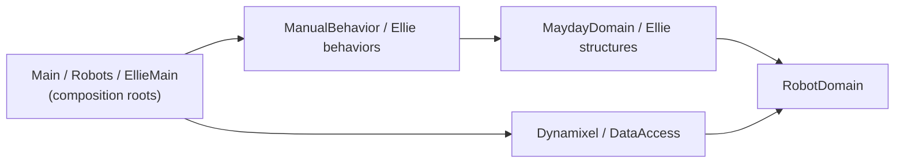

# Mayday

Mayday is a C# robotics control library and learning platform for two robots: **Mayday**, a hexapod, and **Ellie**, an articulated mobile robot. It covers behavior, motion planning, kinematics, robot structures, actuator control and hardware communication. The goal is reliable abstractions over the physical world, with behavior that is testable and with hardware and algorithms that can be swapped independently.

Projects with special rules have their own `CLAUDE.md` (`Test`, `Dynamixel`, `RobotDomain`, `Ellie`), which loads when you work there. Every project has a `README.md` describing its responsibility, dependencies and invariants: **read it before changing that project.**

## Solution layout

`Mayday.sln`; projects target `net10.0` with nullable reference types and implicit usings.

| Project | Role |
|---|---|
| `RobotDomain` | Shared foundation: geometry, links, joints, structures, motion, behavior, timing. |
| `MaydayDomain` | Hexapod structure, legs, postures, joint limits, kinematics, motion planning. |
| `Dynamixel` | Actuator adapter, register/unit conversions, driver, communication bus. |
| `ManualBehavior` | Manually selected Mayday behaviors, terminal-driven experiments. |
| `Robots` | Mayday robot assembly and factories. |
| `Main` | Mayday executable and composition root. **Starts real hardware.** |
| `MaydayDataAccess` | Mayday persistence, e.g. leg posture-by-position maps. |
| `Generic` | Shared utilities and terminal abstractions; independent of robot layers. |
| `Test` | Main xUnit project (`Unit`, `Integration`, `Utilities`). |
| `Ellie\EllieMain` | Ellie structure, behavior, planning, composition and executable. **Starts real hardware.** |
| `Ellie\EllieMainTests` | Ellie end-to-end tests. |
| `DataAccess`, `Ternimal` | Ancillary; inspect their code and references before relying on them. |

## Commands

```powershell
dotnet build Mayday.sln
dotnet test Test\Test.csproj
dotnet test Ellie\EllieMainTests\EllieMainTests.csproj
```

Run the smallest relevant test project first. Several projects set `TreatWarningsAsErrors`: fix warnings at their cause.

## Hard rules

- **Physical hardware:** `Main`, `EllieMain` and tests marked `PhysicalRobotFact`/`PhysicalRobotTheory` can move a real robot. Run them only after the user confirms the robot, port and operating conditions in this conversation. Verify motion and driver changes with simulation, echo joints or hardware-independent tests.
- **Safety limits:** preserve joint limits, velocity limits and other motion constraints when changing motion or driver behavior.
- **Units:** represent physical quantities with `UnitsNet` types (`Angle`, `Length`, `RotationalSpeed`), never bare numbers.
- **Focus:** keep each change to its task; leave unrelated formatting, renames and restructuring for their own change.
- **Prior decisions:** check [ADRs](docs/adr/README.md) before changing a boundary. Record a deliberate deviation in a new ADR with its tradeoffs.

## Architecture

Dependencies point inward toward stable abstractions:



- `RobotDomain` and `Generic` stay free of robot-specific, startup and hardware-library dependencies. Mayday and Ellie share `RobotDomain` contracts and never reference each other's structure. See [architecture map](docs/architecture/README.md) and its documented exceptions.
- **Composition roots** (`Main\Program.cs`, `Robots` factories, `Ellie\EllieMain\Program.cs`) construct concrete implementations and own lifecycle resources. Pass dependencies explicitly through constructors; keep hardware initialization in composition roots.
- **Public surface:** types at a namespace root are that namespace's public API. Put implementation details in an `Internal` namespace/folder, and depend only on another namespace's root types. Place each type beside the concept it models.
- Before adding a project reference, check whether an existing abstraction already provides the dependency.

## C# conventions

Match the surrounding file: file-scoped namespaces, `_camelCase` private fields, records, primary constructors, collection expressions, `LanguageExt` options/effects and LINQ where nearby code uses them. Keep immutable collections immutable and give any mutable state one clear owner. Validate configuration and external input at boundaries and fail explicitly. Keep the domain vocabulary already used in the project.

## Testing

Work **outside-in** (*Growing Object-Oriented Software, Guided by Tests*): an end-to-end or integration test for the behavior, then unit tests for collaborators and edge cases, then the smallest implementation.

Tests are a second, independent **ledger** of behavior:
- **Behavior change:** make a test go red against the old behavior, then green with the implementation. Change an existing expectation only when the user confirms the contract changed.
- **Refactoring:** leave the ledger untouched; existing tests prove behavior is preserved.

Details on test conventions are in `Test/CLAUDE.md`.

## Documentation

- Public methods get XML docs covering behavior, contracts and side effects. Interfaces and significant classes explain their purpose and role.
- **Preserve the abstraction:** XML docs on interfaces, public methods, and classes describe the contract a caller relies on (what, preconditions, results, side effects) and stay true when the implementation is swapped. Implementation notes (algorithm, numeric precision, library choice, why this approach) live as comments inside the method or class body, beside the code they explain.
- Update the project `README.md` when responsibilities, APIs, boundaries or invariants change, and update diagrams with the behavior they show. Describe current behavior as current and planned behavior as planned.
- Use fenced Mermaid for diagrams; link an existing diagram instead of duplicating it.

## Repository knowledge

[knowledge/INDEX.md](knowledge/INDEX.md) maps ADRs, findings, root causes, lessons, pitfalls, failed attempts and task summaries.

- **Before non-trivial work:** read the index and the records relevant to the affected area. Name the records you relied on (or say none apply) when proposing the change.
- **After a real discovery, decision, diagnosed failure, abandoned approach or significant completed task:** use the `record-knowledge` skill. It proposes records and waits for approval before writing them.

## Commits

Commit each intent as soon as it is complete and its tests pass, without waiting to be asked. Work on a feature branch, push it and open a pull request when the work is complete; the user reviews, approves and merges. Stage only the files for this commit's intent, so each commit holds **one intent**: its subject needs no "and".

- **Order:** refactoring commits come before, and separate from, the behavior commits they enable.
- **Together:** a behavior change ships with its tests, XML docs, README updates and the ADR that records its decision. Use `test:` only for tests added to existing behavior.
- **Apart:** findings, root causes, lessons, pitfalls, failed attempts and task summaries get their own `docs:` commit, because they outlive the code: reverting the change keeps the record.
- **Merge style:** ask for a merge commit or rebase merge, never a squash, so these separate commits survive in history.

Subject: `<type>: <imperative summary>`, at most 72 characters, type one of `feat`, `fix`, `refactor`, `test`, `docs`, `chore`.

Body, for every type except `chore`: `Problem:`, `Rationale:` (why this approach over the obvious alternative), `Impact:` (say "No behavioral change." when true). Separate fields with a blank line and add the attribution trailer last.

```text
refactor: keep implementation notes out of the Q.Rotate contract

Problem: The Q.Rotate XML doc described how it computes (vector transform,
float precision), which leaks implementation into the public contract.

Rationale: The doc states the contract only; the how stays as inline comments
next to the code, which is where a maintainer needs it.

Impact: No behavioral change.

Co-Authored-By: Claude Sonnet 5.5 <noreply@anthropic.com>
```
