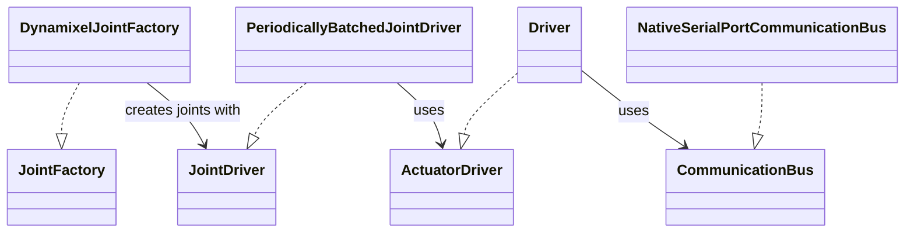

# Dynamixel

## Responsibility

Adapt Dynamixel actuators and native serial communication to robot driver and joint contracts.

## Public APIs

`CommunicationBus`, `NativeSerialPortCommunicationBus`, `Driver`, `DynamixelJointFactory`, register/unit conversion types.

## Key Concepts

IDs, control registers, batched reads/writes, motor angle and speed conversion.

## Class relationships

The factory creates a joint driver backed by a Dynamixel driver and communication bus. The bus interface keeps native port access replaceable; arrows below denote implementation or use, not project references.

## Dependencies

`Generic`, `RobotDomain`, and native/vendor packages in `Dynamixel.csproj`.

## Dependency Rules

Keep native SDK calls within this adapter; higher-level code should use stable contracts.

## Invariants

`NativeSerialPortCommunicationBus` serializes operations on its port; preserve lock coverage for shared native state.

## Architectural Constraints

Opening ports and enabling/moving motors are explicit hardware actions; do not run casually.

## Common Pitfalls

[Physical runs](../knowledge/pitfalls/physical-runs.md); uncoordinated port access can corrupt communication.

## Related ADRs

[Hardware boundary](../docs/adr/0002-hardware-adapter-boundary.md).

## Related Findings

[MaydayDomain reference](../knowledge/findings/mayday-domain-hardware-reference.md).

## Related Root Causes

[Interpolation baseline drift](../knowledge/root-causes/interpolation-baseline-drift.md).

## Related Lessons Learned

[Goal versus measured state](../knowledge/lessons-learned/goal-versus-measured-state.md).

## Related Failed Attempts

[Measured-angle interpolation](../knowledge/failed-attempts/measured-angle-interpolation.md).
