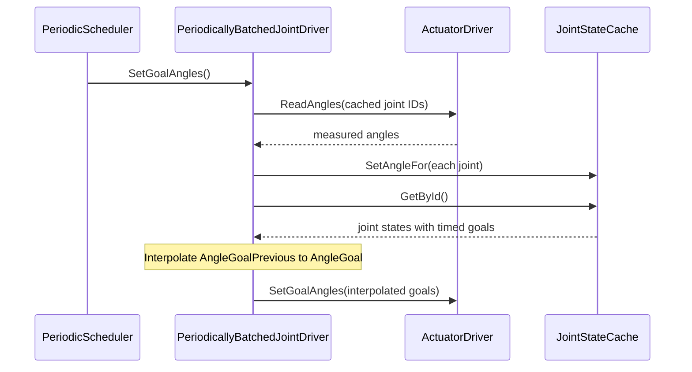

# Shared motion

## Responsibility

Define planning and actuator-driving contracts plus periodic batched drivers.

## Public APIs

`MotionPlan`, `MotionPlanner`, `ActuatorDriver`, `JointDriver`, `WheelDriver`, `PeriodicallyBatchedJointDriver`, `PeriodicallyBatchedWheelDriver`.

## Key Concepts

Timed goals, state cache, actuator IDs, batched updates.

## Joint update sequence

The diagram describes one periodic update after initialization; the measured angle is cached for feedback, while interpolation uses the previous and current *commanded* goals rather than rebasing on the sensor reading.

## Dependencies

`RobotDomain.Structures`, `RobotDomain.Time`, and `Generic`; concrete adapters implement device IO elsewhere.

## Dependency Rules

Never import native Dynamixel operations into shared drivers.

## Invariants

`PeriodicallyBatchedJointDriver` synchronizes driver access and uses previous commanded goal for interpolation.

## Architectural Constraints

Periodic cadence and cancellation affect motion safety; review before changing them.

## Common Pitfalls

[Measured-angle baseline](../../knowledge/pitfalls/interpolation-baseline.md).

## Related ADRs

[Hardware boundary](../../docs/adr/0002-hardware-adapter-boundary.md).

## Related Findings

[Scheduler construction](../../knowledge/findings/scheduler-constructed-inside-domain-classes.md)

## Related Root Causes

[Interpolation drift](../../knowledge/root-causes/interpolation-baseline-drift.md), [Test host crash](../../knowledge/root-causes/test-host-crash-from-scheduler-failfast.md)

## Related Lessons Learned

[Goal versus measured state](../../knowledge/lessons-learned/goal-versus-measured-state.md).

## Related Failed Attempts

[Measured-angle interpolation](../../knowledge/failed-attempts/measured-angle-interpolation.md).
