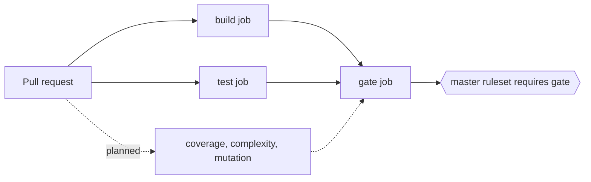

# Gate pull requests with one aggregate check

## Status

Superseded by [ADR 0006](0006-run-quality-gates-locally.md)

## Context

`master` had no automated check. Every change, by the owner or by an agent, could reach it unverified. The goal is a gate that grows: build today, then unit tests, coverage, complexity and mutation testing, and the same gate for agent-authored pull requests. The repository is public, so GitHub rulesets and GitHub-hosted runners are free. Tests were not yet green when this was decided ([task summary](../../knowledge/task-summaries/pr-gating-and-test-baseline.md)).

## Decision

- `.github/workflows/ci.yml` runs on pull requests to `master` and on pushes to `master`. Its `gate` job `needs` every gated job. It runs with `if: always()` and fails unless every dependency succeeded, so a failed, cancelled or skipped dependency fails it.
- The ruleset "master gate" requires only the check `gate`, reported by GitHub Actions (integration id 15368). It also requires pull requests, allows only rebase merges (the repository setting), requires branches to be up to date, blocks deletion and force-push, and has no bypass actors.
- New gates are added to `gate`'s `needs` list, so the ruleset does not change when a gate is added.

## Diagram (if helpful)

Solid arrows exist today; dotted ones are planned. The `test` job joined the gate after its first clean-runner runs exposed two problems ([root cause](../../knowledge/root-causes/tests-failing-only-on-a-clean-runner.md)).

## Alternatives Considered

- One required check per job: every new gate means editing the ruleset, and a path-filtered or skipped check needs special handling.
- A private repository on the free plan: checks would run but could not block a merge.
- Letting the owner bypass in an emergency: an agent running with the owner's credentials could use the same bypass.

## Why

A skipped required check counts as passing on GitHub. A `gate` job without `always()` would be skipped when `build` failed, and the ruleset would let the pull request merge. Pull request #21 (closed unmerged) had a deliberate compile error: `build` and `gate` both failed. A direct push to `master` was rejected with "push declined due to repository rule violations".

## Consequences

- Benefits: one stable required check; the same gate for every author; adding a gate is a workflow edit.
- Costs: the repository admin can still edit or disable the ruleset in GitHub settings, so "no bypass" means no way around it while it is on.
- Limitations: `build` and `test` are gated. The quality gates are planned. Not yet exercised: up-to-date enforcement, and a cancelled or skipped dependency. The Ellie tests have two failures that predate this work and are not covered.

## Related Components

[Test](../../Test/README.md), [repository root](../../README.md)

## Related ADRs

[0004](0004-quarantine-failing-tests-with-a-trait.md), [0006](0006-run-quality-gates-locally.md) (supersedes this)

## Related Findings

None recorded.

## Related Root Causes

[Test host crash from scheduler FailFast](../../knowledge/root-causes/test-host-crash-from-scheduler-failfast.md)
