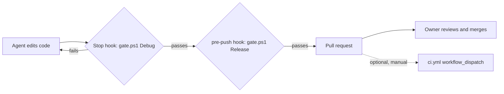

# Run quality gates locally; GitHub CI is optional

## Status

Accepted. Supersedes [ADR 0003](0003-gate-pull-requests-with-one-aggregate-check.md).

## Context

[ADR 0003](0003-gate-pull-requests-with-one-aggregate-check.md) made the `gate` job of a GitHub Actions workflow the one required check for `master`. In use, GitHub-hosted `windows-latest` runners waited a long time in the queue before a job started (reported by the owner; the wait was not measured). The wait sat in every feedback loop of an agent-driven workflow, where an agent finishes a change in minutes and then idles on a remote check. The checks themselves are small: a build and the non-quarantined tests take about 20 seconds on the development machine.

## Decision

- `scripts/gate.ps1` is the gate: build, the tests not marked `[Quarantine]`, and the Pester tests of the scripts themselves, with `MAYDAY_ROBOT_IS_CONNECTED` forced to `False`. It remembers a pass per configuration for an unchanged working tree, so repeat runs cost nothing.
- Two hooks enforce it. A Claude Code `Stop` hook (`scripts/claude-stop-gate.ps1`, configured in `.claude/settings.json`) runs it in Debug and blocks a turn from ending while it fails. A `pre-push` hook (`.githooks/pre-push`, enabled with `git config core.hooksPath .githooks`) runs it in Release.
- `.github/workflows/ci.yml` triggers on `workflow_dispatch` only. It is an optional second opinion on a clean runner, not a merge requirement.
- The `master gate` ruleset must no longer require the `gate` check, because that check no longer reports on pull requests. The remaining rules stand: pull requests, rebase merges only, no deletion or force-push. The owner reviews and merges every pull request.

## Diagram (if helpful)

Solid arrows are current behavior; the dotted arrow is available but not required.

## Alternatives Considered

- Keep the required GitHub check and wait: the cost being avoided.
- Move the jobs to `ubuntu-latest`: queues are often shorter, but nothing verified that the tests pass on Linux, and the wait would remain in the loop.
- A self-hosted runner on the development machine: removes the queue but keeps a remote round trip, and needs the machine on and the runner secured.
- Local gates only, no CI at all: loses the clean-runner check entirely, which has caught real problems ([root cause](../../knowledge/root-causes/tests-failing-only-on-a-clean-runner.md)). Keeping the workflow manual keeps that option.

## Why

A gate belongs where the feedback loop is. Running the same checks locally gives an agent a result in seconds, and the Stop hook makes the check mandatory for agent work, because the harness runs it, not the agent. The owner's review of each pull request remains the human gate.

## Consequences

- Benefits: fast feedback; no dependency on runner availability; the gate is enforced during agent work rather than after it.
- Costs: nothing remote verifies a pull request, so a clean-runner failure (missing files, core count, ordering) is found only if someone dispatches the workflow. A local pass is not proof against a fresh checkout.
- Limitations: both hooks are bypassable (`git push --no-verify`, editing `.claude/settings.json`), and `core.hooksPath` is per clone. The protection against force-push and deletion remains in the ruleset. `Ellie\EllieMainTests` is not gated, as before. ADR 0003's plan to add quality gates to the `gate` job's `needs` list now means adding steps to `gate.ps1`.

## Related Components

[Test](../../Test/README.md), [scripts](../../scripts/README.md), [repository root](../../README.md)

## Related ADRs

[0003](0003-gate-pull-requests-with-one-aggregate-check.md) (superseded), [0004](0004-quarantine-failing-tests-with-a-trait.md), [0007](0007-infrastructure-code-is-tested-like-product-code.md)

## Related Findings

None recorded.

## Related Root Causes

[Tests that passed locally failed on a clean CI runner](../../knowledge/root-causes/tests-failing-only-on-a-clean-runner.md)
