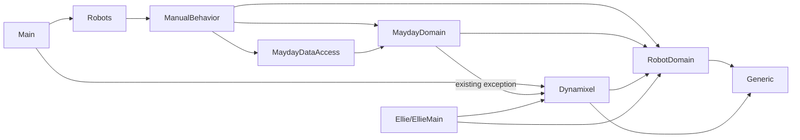

# Architecture map

The [root README](../../README.md) describes Mayday's layered design. [AGENTS.md](../../AGENTS.md) describes development constraints; [the knowledge index](../../knowledge/INDEX.md) links decisions, incidents, and component documentation. Read project files for actual references before changing the dependency graph.

`Generic` and `RobotDomain` provide shared utilities and robot abstractions. `MaydayDomain` models hexapod structure and planning; `ManualBehavior` selects Mayday goals; `MaydayDataAccess` persists Mayday maps; `Dynamixel` adapts physical actuators. `Robots` assembles Mayday dependencies and `Main` starts the application. `Ellie/EllieMain` contains Ellie's model, planning, behavior and composition. Tests live in `Test` and `Ellie/EllieMainTests`. `DataAccess`, `MauiApp1`, and `Ternimal` are separate/experimental projects; do not assume they are part of either primary runtime.

The intended dependency direction is from applications and adapters toward shared abstractions ([ADR 0001](../adr/0001-stable-robot-abstractions.md)). The current `MaydayDomain` project references `Dynamixel`; see the [finding](../../knowledge/findings/mayday-domain-hardware-reference.md) before treating the ideal layering as an already enforced rule. Concrete device creation belongs at composition boundaries ([ADR 0002](../adr/0002-hardware-adapter-boundary.md)); physical tests require opt-in.

## Current project dependencies

The diagram shows selected *direct project references* and their direction, not every type-level relationship. It intentionally includes the existing `MaydayDomain` to `Dynamixel` reference, which is an exception to the intended stable-core dependency direction. `Main` has additional direct references; consult the `.csproj` files for the complete graph.

## Diagram conventions

Use small, source-controlled diagrams where they reduce the effort of understanding dependencies, object relationships, or temporal behavior. Prefer fenced Mermaid for inline Markdown rendering: a flowchart for boundaries/dependencies, `classDiagram` for key classes and interfaces, and `sequenceDiagram` for startup, scheduling, or device communication. PlantUML or another text-based format is also acceptable if its source and a human-viewable rendering are accessible from the documentation. Include a short textual explanation, mark existing versus intended relationships, and link reusable diagrams instead of copying them across READMEs. Update diagrams when relevant code or decisions change; avoid diagrams for trivial structures.
