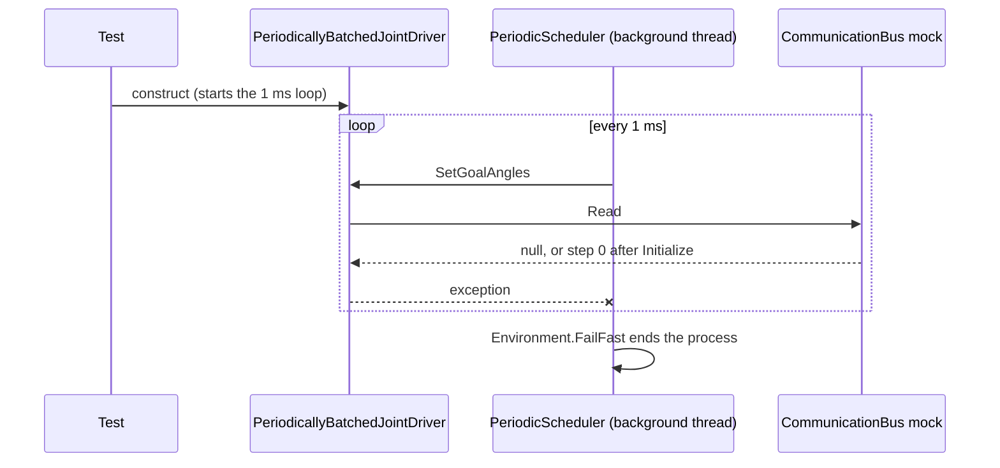

# Test host crash from scheduler FailFast

## Symptoms

`dotnet test Test\Test.csproj` aborted with "Test host process crashed", so the run stopped partway and hid most results. The first run reported 7 failures among 52 tests; once the crash was removed, the full run was 212 tests with 46 failures. The output ended with a `FailFast` stack through `RobotDomain.Time.PeriodicScheduler.CallActionWithErrorLogging`.

## Investigation

- `dotnet test --filter "FullyQualifiedName~PeriodicallyBatchedJointDriverTests"` crashed on 3 of 3 runs. No other test class crashed when run alone, and excluding this class made the full run survive (209 tests, 45 failing at the time).
- First source: the exception was `ArgumentNullException` from `Dynamixel.Driver.ReadAngles` (line 50). The test's `CommunicationBus` mock had no setup for `Read(IEnumerable<Id>, ControlRegister)`, and Moq returns `null` for an unconfigured `IReadOnlyDictionary`.
- Second source, found after the first was fixed: `PeriodicallyBatchedJointDriver.Initialize` reads the goal position through the single-id `Read`, which the mock answered with `0`. `StepAngle.ToAngle(0)` was -0.50024 revolutions, which `StepAngle.ToSteps` rejected, so the next loop iteration threw. See [the step-angle root cause](step-angle-4094-counts.md).
- The tests never disposed the driver, so each test left a 1 ms loop running.
- Which test appeared to crash was a race between background loops, not a property of the named test. `--blame` named a bystander.

## Failure Sequence (if helpful)

## Root Cause

Three things combined:

1. The tests' mock bus returned Moq defaults (`null`, `0`) that the real bus never returns.
2. The driver starts its periodic loop in its constructor and the tests never stopped it.
3. `PeriodicScheduler` answers any exception on the loop thread with `Environment.FailFast`. That is deliberate for the real robot, but a mistake in a test then ends the whole test process. The code carries a TODO suggesting an injectable fatal-error handler.

## Resolution

- `813fa03` configured `Read` on the mock. It was not enough: it only moved the crash to the second source. This attempt assumed a single cause, and the `Test` project kept aborting.
- `d69284f` gave the mock a joint at the center step and made the test class dispose the driver. The full run then completed identically on repeated runs.
- `cc9ab54` injected a `FatalErrorHandler` through the constructors ([finding](../findings/scheduler-constructed-inside-domain-classes.md)), so a test with a mocked driver records a loop error instead of ending the host. `7eced7a` makes the loop stop once a handler returns. Production and physical tests still use `FailFastFatalErrorHandler`.

## Prevention

Follow [the periodic-loops pitfall](../pitfalls/periodic-loops-in-tests.md). Check that a full run completes, not just the class under change; a fix that only changes which line crashes does not fix the host.

## Related Components

[RobotDomain/Time](../../RobotDomain/Time/README.md), [RobotDomain/Motion](../../RobotDomain/Motion/README.md), [Dynamixel](../../Dynamixel/README.md), [Test](../../Test/README.md)

## Related Tasks

[PR gating and test baseline](../task-summaries/pr-gating-and-test-baseline.md)

## Related Decisions

[ADR 0004](../../docs/adr/0004-quarantine-failing-tests-with-a-trait.md)
